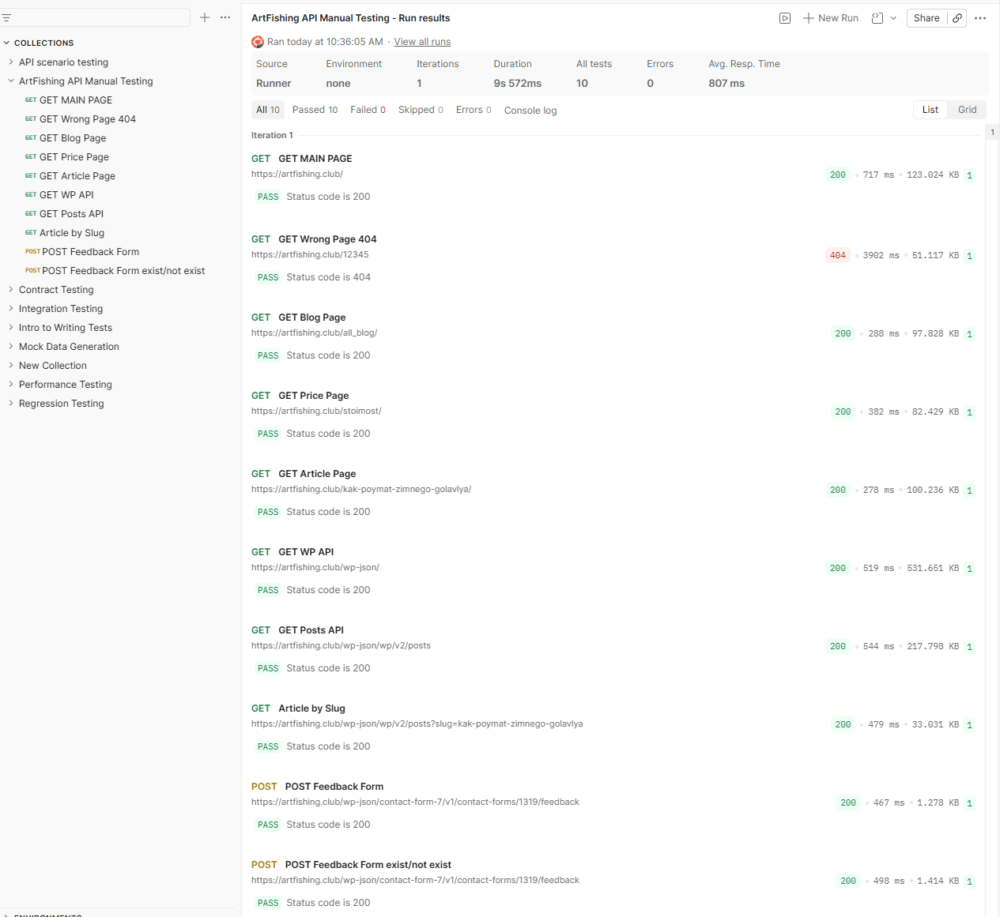

# Manual API Testing – ArtFishing Website

## 📌 Project Description

This project demonstrates manual API testing of a real website using Postman.

Testing was performed on a WordPress-based website using the Contact Form 7 plugin and REST API endpoints.

---

## 🛠 Tools Used

* Postman
* REST API
* WordPress (Contact Form 7)

---

## 🎯 Testing Scope

* GET requests (website pages and API)
* POST requests (contact form submission)
* Validation testing
* Positive and negative scenarios
* Basic automated tests (status code validation)

---

## 🔗 Tested Endpoints

### GET Requests

* Main page → 200 OK
* Wrong page → 404 Not Found
* Blog page → 200 OK
* Price page → 200 OK
* Article page → 200 OK
* WP API → 200 OK
* Posts API → 200 OK

### POST Request

```text
POST https://artfishing.club/wp-json/contact-form-7/v1/contact-forms/1319/feedback
```

---

## 📦 Request Example (form-data)

```text
your-name:Aleks
your-email:test@example.com
your-subject:Test message
your-message:Hello from Postman
_wpcf7:1319
_wpcf7_unit_tag:wpcf7-f1319-p1320-o1
```

---

## ✅ Test Scenarios

### ✔ Valid Email

* Expected: Request processed successfully
* Result: Passed (status: spam or success, no validation errors)

### ✔ Invalid Email

* Input: `your-email = test`
* Expected: Validation error
* Result: Passed (`validation_failed`)

### ✔ Missing Required Fields

* Expected: Validation error
* Result: Passed

---

## 📸 Test Execution Example



---

## 🚀 Key Features

* Manual API testing using Postman
* Validation of HTTP status codes (200, 404)
* Testing of form validation logic
* Basic automated tests using JavaScript in Postman

---

## 📂 Project Structure

```text
manual-api-testing-artfishing
│
├── README.md
├── postman/
│   └── ArtFishing API Manual Testing.postman_collection.json
└── screenshots/
    └── run_results.png
```
